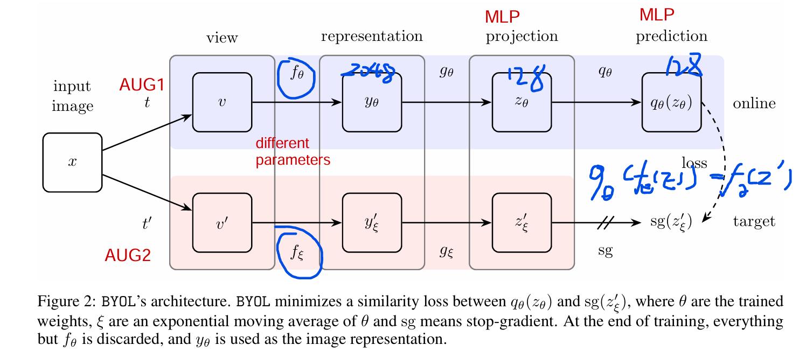
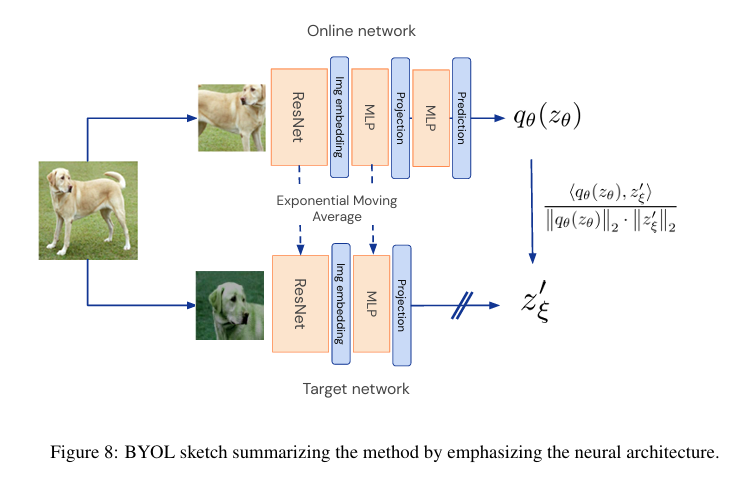
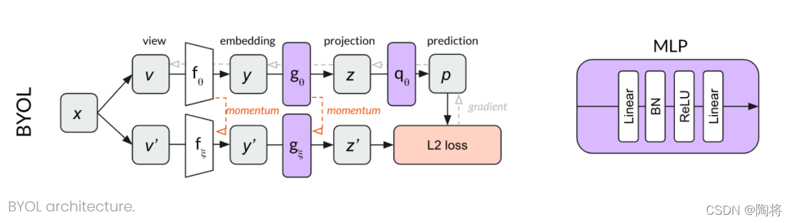
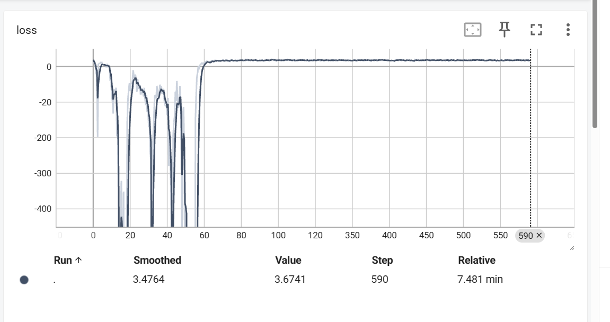

# BYOL Implementation on CIFAR10/STL10

## Overview

This repository provides an implementation of the Bootstrap Your Own Latent (BYOL) algorithm on the CIFAR10 dataset. BYOL is a self-supervised learning method that allows models to learn robust image representations without the need for labeled data. This implementation is inspired by the repository [sthalles/PyTorch-BYOL](https://github.com/sthalles/PyTorch-BYOL) and includes several modifications and improvements:

1. The loss function used is the one described in the original paper, based on cosine similarity.
2. The implementation has been updated to work on the CIFAR10 dataset.
3. Syntax improvements and extensive Chinese comments have been added for better understanding.

## Key Features

- Implementation of the BYOL algorithm for self-supervised learning.
- Training on the CIFAR10 dataset.
- Use of the original loss function from the BYOL paper.
- Extensive Chinese comments for better code comprehension.
- Visualization of the model architecture and training process.

## Getting Started

### Prerequisites

Before you begin, ensure you have met the following requirements:

- Python 3.x
- PyTorch 1.x
- CUDA (if using GPU)
- Torchvision
- YAML

You can install the required Python packages using pip:

```bash
pip install torch torchvision torchaudio yaml
```


### Usage

To train the model, run the following command:

```bash
python pretrain.py
```

This will start the training process with default parameters. You can adjust the parameters by modifying the `configs.yaml` file.

## Code Structure

Here's an overview of the code structure and key components:

```
BYOL-CIFAR10/
│
├── configs.yaml         # Configuration file for the model and training parameters.
├── data.py             # Data loading and augmentation.
├── model.py            # Definition of the ResNet and MLP modules used in BYOL.
├── pretrain.py         # Main script for training the BYOL model.
├── architecture.png    # Diagram of the BYOL architecture.
├── img.png             # Sketch summarizing the BYOL method.
├── img_1.png           # Architecture overview of BYOL.
└── README.md           # This file.
```

## Visualization

### BYOL Architecture

The following image provides a visual representation of the BYOL architecture:



This diagram illustrates the main components of the BYOL algorithm, including the online network, target network, and projection head.

### BYOL Method Sketch

The next image is a sketch summarizing the BYOL method:



This sketch emphasizes the neural architecture and the process of computing the projection and prediction for both views of an image.

### BYOL Architecture Overview

The final image provides an overview of the BYOL architecture:



This image shows the flow of data through the network, including the embedding, projection, and prediction steps.

## TensorBoard Loss Visualization

During the training process, the loss values are logged and can be visualized using TensorBoard. The following screenshot captures the loss values over the training steps:



In the early stages of training, as seen in the screenshot, there is an observable oscillation in the loss values. This initial fluctuation in the loss is currently not fully understood and is an area for further investigation. We are seeking insights from those who are well-versed in the intricacies of self-supervised learning and the BYOL algorithm to shed light on this phenomenon.

If you have any knowledge or suggestions regarding the initial loss oscillation, please feel free to contribute to the discussion. Your input could be invaluable in fine-tuning the training process and improving the stability and performance of the model.

### How to View Loss in TensorBoard

To view the loss and other metrics in TensorBoard, follow these steps after running the training script:

1. Start TensorBoard by running the following command in your terminal:
   ```bash
   tensorboard --logdir=logs
   ```
2. Open your web browser and navigate to `http://localhost:6006/` to access the TensorBoard dashboard.
3. Select the `SCALARS` tab to view the loss and accuracy plots.

By monitoring these metrics, you can gain insights into the training process and make informed decisions about hyperparameter tuning and model optimization.

If you have any insights into the initial loss oscillation or suggestions for improvement, please do not hesitate to reach out. Community knowledge sharing is crucial for advancing the field of machine learning and deep learning.


## Acknowledgements

This implementation is inspired by the work in the repository [sthalles/PyTorch-BYOL](https://github.com/sthalles/PyTorch-BYOL). We would like to express our gratitude for their contribution to the field.

## License

This project is licensed under the MIT License - see the [LICENSE](LICENSE) file for details.

